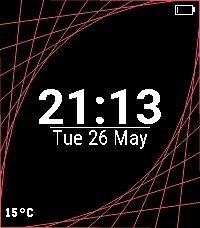

# Parabola

A Pebble watchface featuring a clean digital clock, date, battery indicator, weather display, and animated parabolic decorative lines.



## Features

- Large digital time display (12/24h auto)
- Day, date, and month
- Battery level with charging indicator
- Live weather temperature from Open-Meteo API
- Animated parabola decorative lines (upper-left and lower-right)
- Black background with white text

## Platforms

Supports aplite, basalt, chalk, diorite, emery, flint, and gabbro.

## Build

```bash
npm run build       # TypeScript + pebble build
npm run start       # Build and install on emery emulator
npm run screenshot  # Capture emulator screenshot
```

## Architecture

- `src/c/main.c` -- Window, time, date, battery, weather, and parabola layers
- `src/c/parabola_draw.[ch]` -- Custom parabola decorative layers with animation
- `src/pkjs/index.ts` -- Fetches weather via Geolocation + Open-Meteo API

## License

MIT
